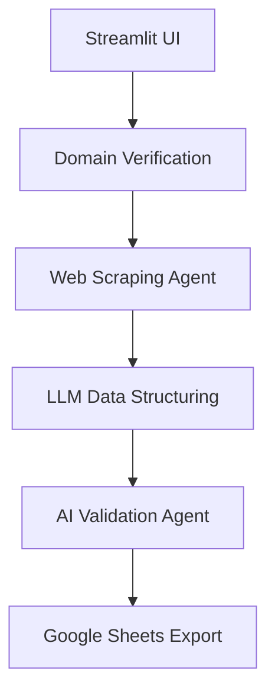

# Company Insight Engine 🕵️♂️

Automated intelligence system that scrapes company data, analyzes it with AI (Llama3-70B), and exports structured insights to Google Sheets.
You can try the demo from here (http://132.145.72.245/)

## 🚀 Key Features
- Web scraping with anti-blocking techniques
- AI-powered data structuring (Groq/Llama3)
- Multi-agent validation workflow (CrewAI)
- Google Sheets integration with OAuth2
- Streamlit dashboard for pipeline control
- Memory/performance optimization (tracemalloc)

## 🛠 Tech Stack
**Core**  
`Python 3.10` `Streamlit` `CrewAI` `Groq API`  
**Web**  
`BeautifulSoup4` `Requests` `tldextract`  
**Data**  
`Google Sheets API` `JSON5` `lxml`  
**DevOps**  
`LRU Caching` `Connection Pooling` `Retry Logic`

## 🖥 Usage Example

```text
============================================================
       === Universal Company Intelligence System ===        
============================================================

🏢 Enter company name:  github

🌐 Suggested website: https://www.github.com
Is this correct? (y/n):  y

🔍 Final Data Preview:
   - Company Name             : GitHub...
   - Website                  : https://github.com...
   - Industry                 : Software Development...
   - Headquarters             : San Francisco, California...
   - Founding Year            : 2008...
   - No.Employees             : 3000...
   - Funding Raised           : $2.7B...
   - Revenue                  : $1.5B...
   - Valuation                : $75B...
   - Company Description      : GitHub is a web-based platform for version control and collaboration...
   - Founders & LinkedIn URLs : Chris Wanstrath: https://linkedin.com/in/chriswanstrath...
   - Key Contacts             : Nat Friedman: CEO, Mike Hanley: CFO...
   - Social Media Links       : Twitter: https://twitter.com/github...
   - AI Products/Services Offe: GitHub Copilot, GitHub Codespaces...
   - Technology Stack         : JavaScript, HTML, CSS, Node.js...
   - Customer Base            : Developers, Software companies...
   - Case Studies             : Duolingo boosts developer speed by 25%...
   - Compliance and Regulatory: GDPR, SOC 2...
   - Market Presence          : Global...
   - Competitor Analysis      : GitLab, Bitbucket...

💾 Save to Google Sheets? (y/n): y

🎉 Data saved successfully!

📊 Performance Metrics:
   - Memory Usage: 54.9MB (Peak: 57.0MB)
   - Processing Time: 14.04s
```

## ⚙️ Architecture

## License:
Please see the LICENSE file for details.

## Contact:
If you have any questions, please feel free to contact us at mostafathemar@email.com.
